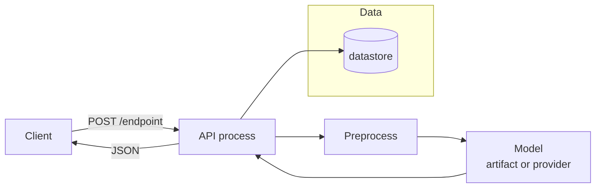
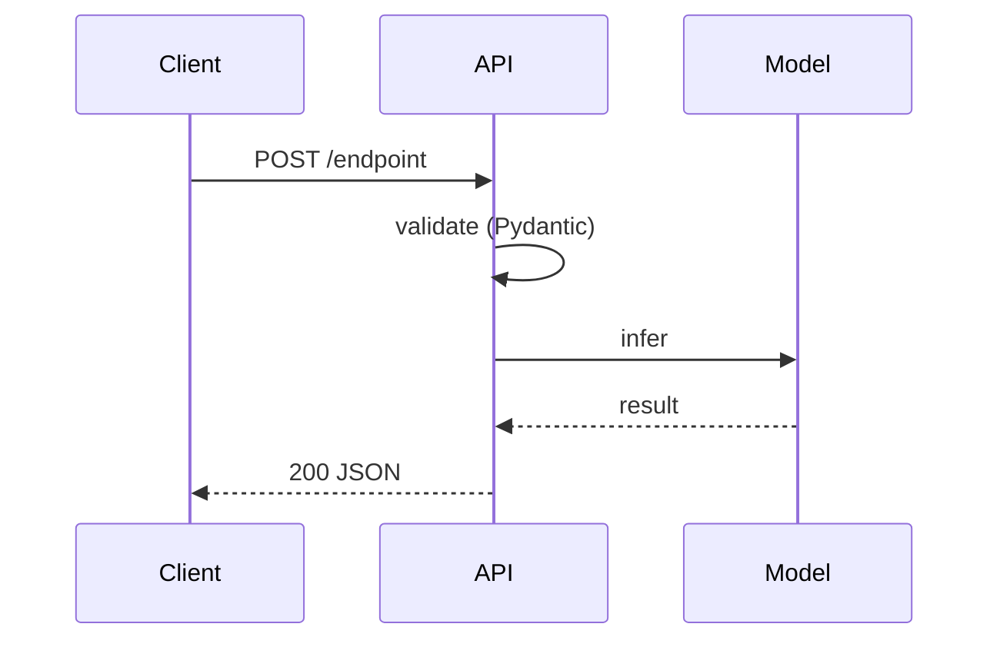

# Architecture — <module>

## Containers

Every process, datastore, external system and the user is a box. Model
components are their own boxes labelled with the artifact or provider. Dashed
boundaries mark authenticated zones.

## Primary request flow

## Components

| Box | Lives at | Responsibility |
|-----|----------|----------------|
| API process | `app/main.py` | ... |
| Model | `data/<artifact>` or `<provider>` | ... |

## External systems

| System | Used for | Failure handling |
|--------|----------|------------------|
| ... | ... | see `docs/failure-modes.md` F-n |
